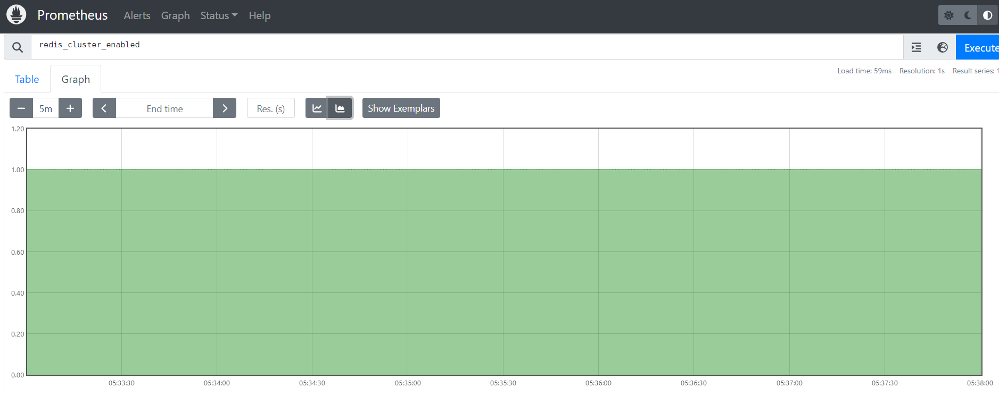
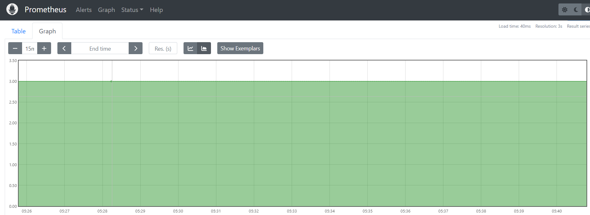
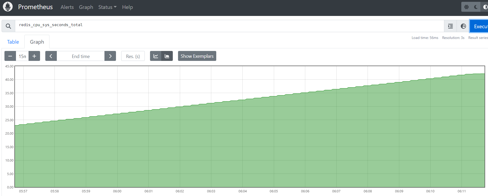
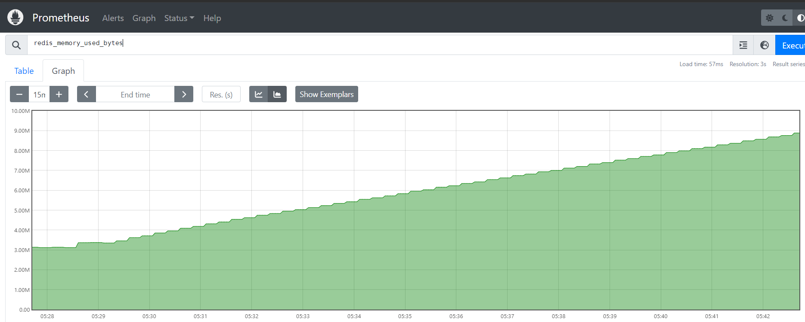
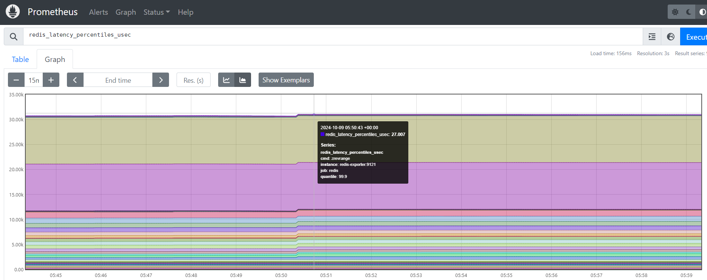
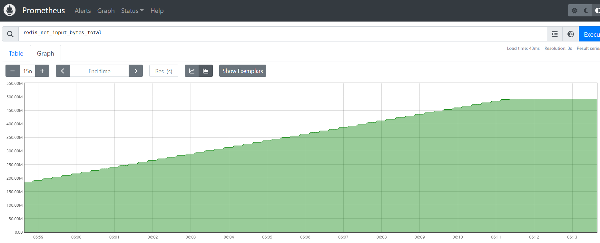
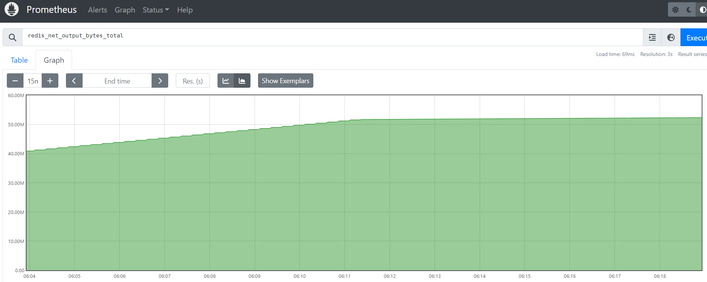
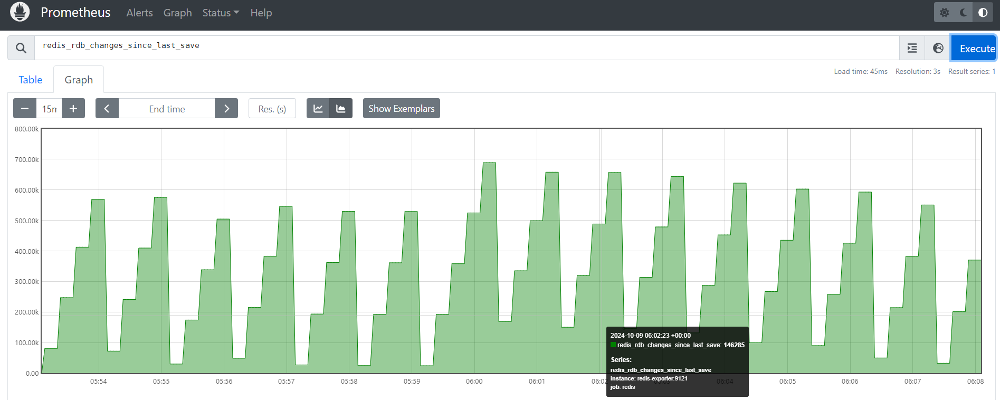
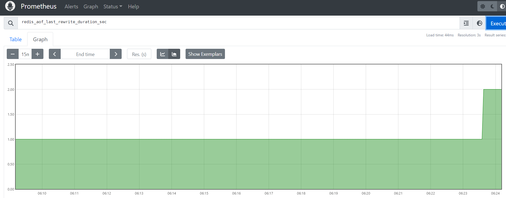

# Garmin-DataInfraEngineer

## Description
This Repo Use Docker Compose YAML file sets up a Redis cluster with three nodes, as well as a Redis Exporter for monitoring and a Prometheus server for collecting metrics. Here’s a breakdown of each service:

## Services

### 1. **Redis Nodes**
   - **Images**: Uses `redis:latest` for all three nodes (`redis-node-1`, `redis-node-2`, `redis-node-3`).
   - **Commands**: Runs Redis in cluster mode on different ports (6379, 6380, 6381), with persistent data storage in `/data`.
   - **Health Checks**: Pings Redis every 10s, with a 5s timeout and 3 retries.
   - **Volumes**: Each node uses a dedicated volume (`redis-data-1`, `redis-data-2`, `redis-data-3`) for persistence.
   - **Restart Policy**: Set to `always`.

### 2. **Cluster Setup**
   - **Image**: Uses `redis:latest`.
   - **Depends On**: Waits for Redis nodes to be healthy before configuring the cluster.
   - **Entrypoint**: Initializes the cluster across nodes with no replicas.
   
### 3. **Redis Exporter**
   - **Image**: Uses `oliver006/redis_exporter:latest` to expose Redis metrics for Prometheus.
   - **Environment**: Points to `redis-node-1` for metrics.

### 4. **Prometheus**
   - **Image**: Uses `prom/prometheus:latest`.
   - **Volume**: Loads configuration from `prometheus.yml` file.
   - **Ports**: Exposes port `12090` for access to Prometheus UI.
   
## Networks & Volumes
   - **Network**: Uses a custom bridge network (`redis-network`) to connect services.
   - **Volumes**: Defines persistent volumes for each Redis node to retain data.

## Monitoring Metrics

### redis_cluster_enabled
* Explain : Redis Cluster Enable

    

### redis_cluster_size
* Explain : Redis Cluster With Three Nodes

    

### redis_cpu_sys_seconds_total
* Explain : CPU Usage

    

### redis_memory_used_bytes
* Explain : Data Storage Size

    

### redis_latency_percentiles_usec
* Explain : The latency percentiles in microseconds for Redis commands

    

### redis_net_input_bytes_total
* Explain : Network Input In Bytes

    

### redis_net_output_bytes_total
* Explain : Network Output In Bytes

    

### redis_rdb_changes_since_last_save
* Explain : RDB Changes Since Last Save

    

### redis_aof_last_rewrite_duration_sec
* Explain : Append Only File Persistence Rewrite Duration

    